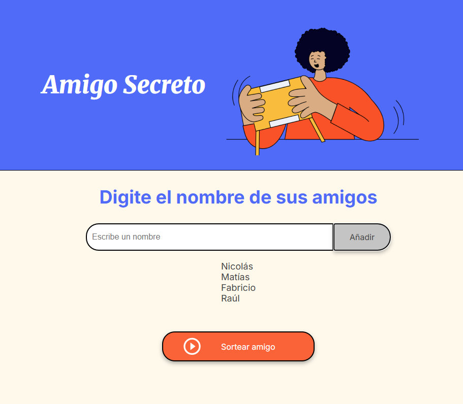
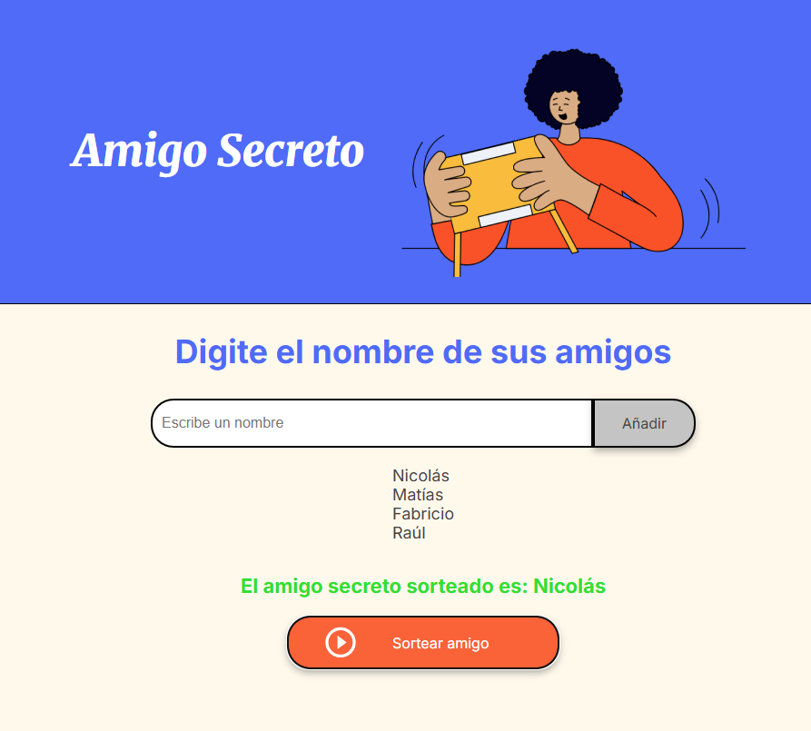

# 🎁 Challenge Amigo Secreto

Este proyecto fue desarrollado como parte de un desafío de **lógica de programación en JavaScript** de **Alura Latam** y permite:

- Agregar amigos a una lista.
- Mostrar la lista de amigos agregados.
- Sortear de manera aleatoria un "amigo secreto".

---

## 🚀 Cómo usar

1. Escribe el nombre de un amigo en la caja de texto.
2. Haz clic en **Añadir**.
3. Repite hasta tener todos los nombres que quieras.
4. Haz clic en **Sortear amigo**.
5. El resultado aparecerá en pantalla.

---

## 🖼️ Vista previa

### Pantalla principal

### Resultado del sorteo

---

## 🛠️ Tecnologías utilizadas

- HTML
- CSS
- JavaScript

---

✍️ Desarrollado como parte del **Challenge Amigo Secreto** de **Alura Latam**, con el objetivo de practicar la lógica de programación y manipulación de arrays en JavaScript.
